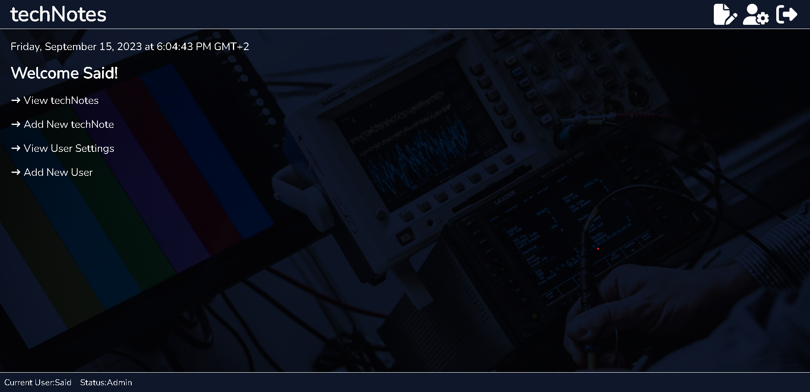

# MERN-Stack-Frontend

> This is Front-End UI that is connected to the Back-End RoR API. This app represents 1/2 (one half) of the full application required to properly work, so please make sure you connect it properly to the Back-End.

## Live Demo
[Live Demo Link](https://mern-technotes-frontend.onrender.com/)

## Screenshot

## Link to the Backend

- Check out the MERN-Stack-Backend [repository](https://github.com/SaidRasinlic/MERN-Stack-Backend.git)

## Built with

- React
- Redux
- RTK Queries

## Getting Started

To get a local copy up and running follow these simple example steps.

### Prerequisites

- Laptop or Desktop
- Web Browser
- Ruby (installed and properly set up)
- IDE (preferably Visual Studio Code)
- Programming Knowledge

### Installation, Setup and Usage

- Clone this [repository](https://github.com/SaidRasinlic/MERN-Stack-Frontend.git)
- Go to the project directory `cd mern-stack-frontend` (case insensitive)
- Run `yarn install` to install gems
- Run `yarn start` to run the app
- Enter `http://localhost:3000/` or `localhost:3000` on your browser to run the app locally

IMPORTANT: Please make sure both of your apps are started (your Front-End on `localhost:3000` and your Back-End on `localhost:3500`), both of your apps need to run simultaneously, so please make sure you start servers on both of the apps.

## Author

👤 **Said Rasinlic**

- GitHub: [@GitHub/SaidRasinlic](https://github.com/SaidRasinlic)
- Twitter: [@Twitter/SaidRasinlic](https://twitter.com/SaidRasinlic)
- LinkedIn: [@LinkedIn/SaidRasinlic](https://www.linkedin.com/in/SaidRasinlic)

## 🤝 Contributing

Contributions, issues, and feature requests are welcome!

Feel free to check the [issues page](../../issues/).

## Show your support

Give a ⭐️ if you like this project!

## Acknowledgments

- StackOverFlow and YouTube GanG 🙌

## 📝 License

This project is [MIT](./LICENSE) licensed.
